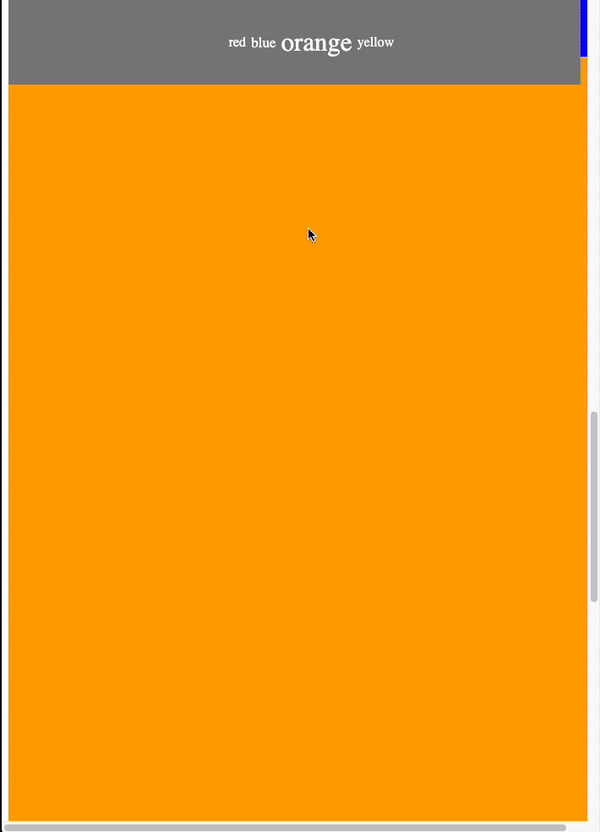

# udacity-frontend-m3-project-landing
Udacity's frontend nanodegree Module 3 project, the landing page. Dynamically added sections, event listeners, element phase overriding, scrolling, dynamically changing element sizes, flexbox container.
---

